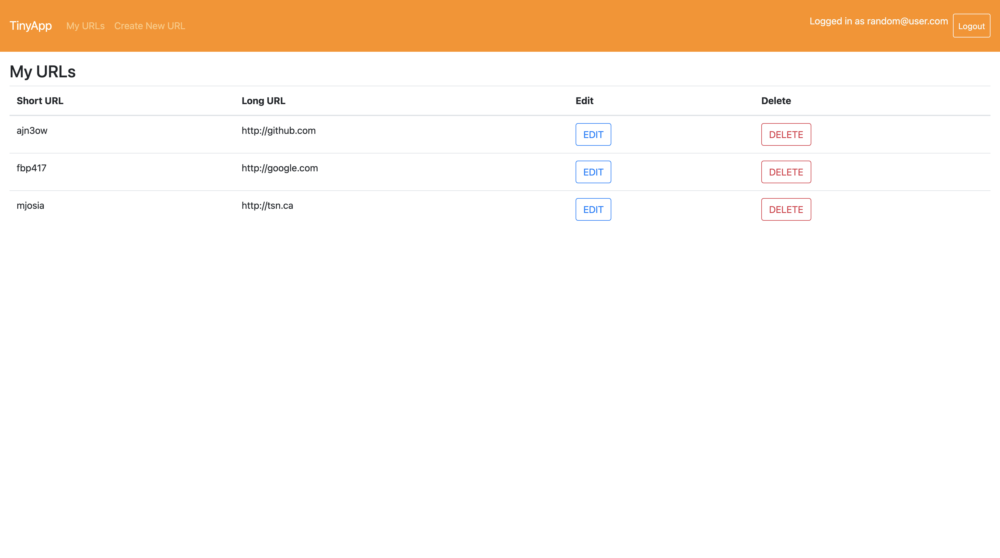
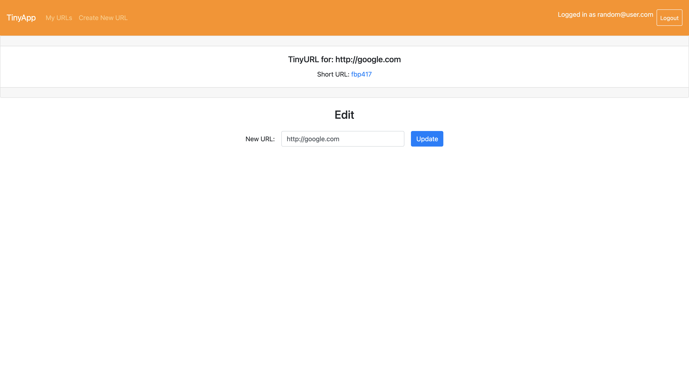
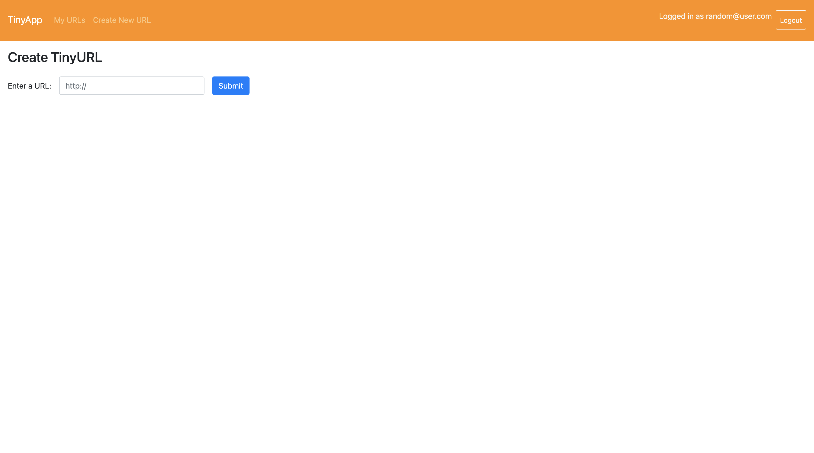

# TinyApp Project

TinyApp is a full stack web application built with Node and Express that allows users to shorten long URLs (à la bit.ly).

## Final Product

## Dependencies

- Node.js
- Express
- EJS
- bcrypt
- body-parser
- cookie-session

## Getting Started

- Install all dependencies (using the `npm install` command).
- Run the development web server using the `npm start` command from repo directory.
- If doing unit test with mocha and chai, comment out `const bcrypt = require('bcrypt');` and  `const saltRounds = 10;`, to avoid bugs while testing. 